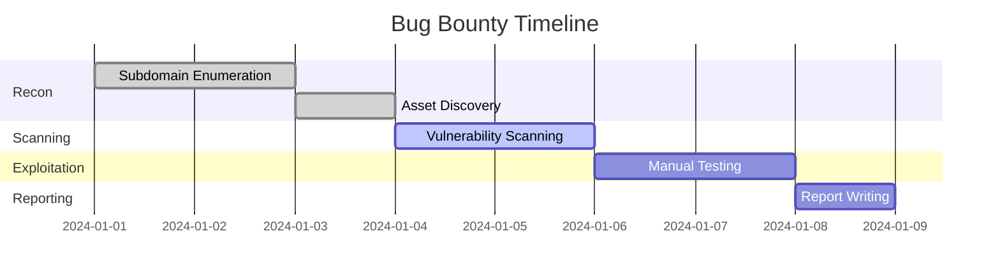

# Full Advanced Bug Bounty Guide (বাংলা)

---

> **লক্ষ্য:** এই গাইডটি একজন Beginner থেকে Pro Level Bug Hunter হওয়ার জন্য Step-by-Step সাজানো হয়েছে। প্রতিটি ধাপে ব্যাখ্যা, কমান্ড, স্ক্রিপ্ট, এবং প্র্যাকটিক্যাল টিপস রয়েছে।

---

## ১. Bug Bounty পরিচিতি

### Bug Bounty কী?
Bug Bounty হলো একটি প্রোগ্রাম যেখানে কোম্পানি বা ওয়েবসাইট মালিকরা তাদের সিস্টেমে নিরাপত্তা দুর্বলতা (vulnerability) খুঁজে বের করার জন্য রিসার্চারদের পুরস্কৃত করে।

### কেন দরকার?
- নিরাপত্তা বাড়ানো
- Responsible Disclosure
- Ethical Hacking
- ক্যারিয়ার ও ইনকামের সুযোগ

### জনপ্রিয় প্ল্যাটফর্মসমূহ
- [HackerOne](https://hackerone.com)
- [BugCrowd](https://bugcrowd.com)
- [Intigriti](https://intigriti.com)
- [YesWeHack](https://yeswehack.com)

---

## ২. প্রয়োজনীয় সেটআপ ও টুলস

### OS সেটআপ
- **Linux (Ubuntu/Kali/Parrot)**: সবচেয়ে বেশি ব্যবহৃত
- **WSL (Windows Subsystem for Linux)**: Windows ইউজারদের জন্য

### Terminal Tools & Fonts
- `zsh`, `oh-my-zsh`, `powerlevel10k`
- Nerd Fonts: [Hack Nerd Font](https://www.nerdfonts.com/font-downloads)

### প্রয়োজনীয় টুলস (ইনস্টলেশন কমান্ডসহ)
```bash
sudo apt update && sudo apt install -y git curl wget python3-pip
# Golang (nuclei, httpx, subfinder ইত্যাদির জন্য)
wget https://go.dev/dl/go1.21.5.linux-amd64.tar.gz
sudo tar -C /usr/local -xzf go1.21.5.linux-amd64.tar.gz
export PATH=$PATH:/usr/local/go/bin

# টুল ইনস্টলেশন
GO111MODULE=on go install -v github.com/projectdiscovery/subfinder/v2/cmd/subfinder@latest
GO111MODULE=on go install -v github.com/projectdiscovery/httpx/cmd/httpx@latest
GO111MODULE=on go install -v github.com/projectdiscovery/nuclei/v2/cmd/nuclei@latest
GO111MODULE=on go install -v github.com/tomnomnom/waybackurls@latest
GO111MODULE=on go install -v github.com/lc/gau/v2/cmd/gau@latest
GO111MODULE=on go install -v github.com/hakluke/hakrawler@latest
pip3 install jsfinder
```

---

## ৩. Step-by-Step Bug Bounty প্রসেস



### ধাপে ধাপে প্রসেস
1. **Reconnaissance**: টার্গেট সম্পর্কে তথ্য সংগ্রহ
2. **Enumeration**: সাবডোমেইন, ডিরেক্টরি, এন্ডপয়েন্ট বের করা
3. **Vulnerability Scanning**: স্বয়ংক্রিয় ও ম্যানুয়াল টেস্টিং
4. **Exploitation**: দুর্বলতা কাজে লাগানো
5. **Reporting**: রিপোর্ট লেখা ও সাবমিট

---

## ৪. Advanced Subdomain Enumeration

### Passive Method
- `subfinder -d example.com -o subs.txt`
- CRT.sh, SecurityTrails, VirusTotal

### Active Method
- `amass enum -d example.com`
- Permutation: `dnsgen`, `altdns`

### ASN Enumeration
```bash
python3 asnmap.py -a <ASN> -o asn_domains.txt
```

### Custom Bash Script (Automation)
```bash
#!/bin/bash
# subenum.sh
# Usage: ./subenum.sh example.com
DOMAIN=$1
subfinder -d $DOMAIN -o subs.txt
amass enum -d $DOMAIN -o amass.txt
dnsgen subs.txt -o perm.txt
cat subs.txt amass.txt perm.txt | sort -u > all_subs.txt
```

---

## ৫. Reconnaissance (তথ্য সংগ্রহ)

### URLs, JS, Secrets, API, Params
- Wayback: `waybackurls example.com > urls.txt`
- GAU: `gau example.com > gau.txt`
- JS Finder: `jsfinder -u https://example.com -o js.txt`
- Hakrawler: `hakrawler -url https://example.com -depth 2 > hak.txt`

### Secrets/Keys Extraction
```bash
grep -Eri 'api[_-]?key|secret|token' js.txt
```

---

## ৬. Vulnerability Assessment (OWASP Based)

### XSS
- টুল: `dalfox`, `kXSS`
- Payload: `<script>alert(1)</script>`
- Example: `dalfox url https://example.com/vuln?param=1`

### SQLi
- টুল: `sqlmap`
- Payload: `' OR 1=1--`
- Example: `sqlmap -u "https://example.com/item?id=1" --batch`

### IDOR
- ম্যানুয়াল টেস্ট: ID পরিবর্তন করে ডেটা এক্সেস

### SSRF
- টুল: `ssrfmap`, Burp Collaborator
- Payload: `http://burpcollaborator.net`

### RCE
- টুল: `nuclei`, `commix`
- Payload: `;id`

### CSRF
- Burp Suite দিয়ে ফর্ম চেক

---

## ৭. Exploitation Techniques

### Manual Exploitation
- Burp Suite দিয়ে রিকোয়েস্ট মডিফাই
- Custom Payload ইনজেকশন

### Automated Tools
- `nuclei -l urls.txt -t cves/`
- `dalfox file urls.txt`

---

## ৮. Report Writing

### Report Format (HackerOne/BugCrowd)
- **Title**: Vulnerability Name
- **Summary**: কীভাবে পেলেন
- **Steps to Reproduce**: ধাপে ধাপে
- **Impact**: কী ক্ষতি হতে পারে
- **PoC**: স্ক্রিনশট, Burp log

### Example:
```
## Title: Stored XSS in Profile Section
## Summary:
Profile update ফিচারে XSS পাওয়া গেছে।
## Steps to Reproduce:
1. Login করুন
2. Profile এ যান
3. Name ফিল্ডে <script>alert(1)</script> দিন
4. Save করুন
## Impact:
Attacker arbitrary JS execute করতে পারবে
## PoC:
[স্ক্রিনশট/ভিডিও]
```

---

## ৯. Automation Scripts

### Recon Script (bash)
```bash
#!/bin/bash
# recon.sh
DOMAIN=$1
subfinder -d $DOMAIN -o subs.txt
amass enum -d $DOMAIN -o amass.txt
cat subs.txt amass.txt | sort -u > all_subs.txt
for sub in $(cat all_subs.txt); do
  httpx -u $sub -o live.txt
  waybackurls $sub >> urls.txt
  gau $sub >> gau.txt
  nuclei -u $sub -o nuclei.txt
  hakrawler -url https://$sub -depth 2 >> hak.txt
  jsfinder -u https://$sub -o js_$sub.txt
  # আরও টুল যোগ করুন
  echo "[+] Done: $sub"
done
```

### Folder Structure
```
recon/
  ├── subs.txt
  ├── amass.txt
  ├── all_subs.txt
  ├── live.txt
  ├── urls.txt
  ├── gau.txt
  ├── nuclei.txt
  ├── hak.txt
  └── js_*.txt
```

---

## 🔟 Bonus Content

### Wordlist Optimization
- Custom wordlist: `assetfinder`, `commonspeak2-wordlists`
- Fuzzing: `ffuf`, `wfuzz`

### Passive vs Active Recon
- Passive: 3rd party sources, no direct interaction
- Active: Direct probing, brute force

### Scope বের করার কৌশল
- Program Policy পড়ুন
- `scope` keyword দিয়ে grep করুন

### Github Dork Automation
```bash
gitdorks_go -q 'api_key' -o dorks.txt
```

### Info Disclosure Enumeration
- `.git`, `.env`, JS Analysis
- `git ls-remote https://example.com/.git`
- `curl https://example.com/.env`

---

## ১১. Best Resources

- [HackerOne Public Reports](https://hackerone.com/hacktivity)
- [BugCrowd University](https://www.bugcrowd.com/university/)
- YouTube: [LiveOverflow](https://www.youtube.com/c/LiveOverflow), [NahamSec](https://www.youtube.com/c/Nahamsec), [Stök](https://www.youtube.com/c/STOKfredrik)
- Blogs: [ProjectDiscovery Blog](https://blog.projectdiscovery.io/), [PortSwigger Web Security](https://portswigger.net/web-security)
- Tool Docs: [Nuclei](https://nuclei.projectdiscovery.io/), [Subfinder](https://github.com/projectdiscovery/subfinder)

---

> **Special Tips:**
> - সব কমান্ড ও স্ক্রিপ্ট কপি-পেস্ট করে ইউজ করা যাবে
> - Automation ও Deep Enumeration এর জন্য Custom Script ব্যবহার করুন
> - প্রতিটি ধাপে কমেন্ট ও ব্যাখ্যা পড়ুন
> - Practice is the key! Happy Hunting! 🕵️‍♂️